# Flujos de Trabajo y Diagramas

## Workflow 1: Feature Compleja - Sistema OAuth2

```
📝 Usuario: "Implementar sistema OAuth2 completo con JWT y rate limiting"

🤖 Claude Code detecta complejidad → Ejecuta @task-planner AUTOMÁTICAMENTE

[@task-planner]
├─ Phase 1: Task Understanding
│  └─ Pregunta: "¿OAuth2 con qué providers? ¿Requisitos de rate limiting?"
│     Usuario: "Google + GitHub, 10 req/min por usuario"
│
├─ Phase 2: Context Gathering (PARALELO ⚡)
│  ├─ @codebase-analyst → Analiza src/auth/
│  │  └─ Encuentra: BaseAuthProvider pattern
│  ├─ @library-researcher → Investiga OAuth2 + JWT
│  │  └─ Recomienda: authlib, pyjwt, slowapi (rate limiting)
│  └─ @archon-expert → Query RAG "oauth2 best practices"
│     └─ Retorna: PKCE flow, token refresh patterns
│
├─ Phase 3: Resource Inventory
│  ├─ Agentes: @prp-expert, @validation-gates, @documentation-manager
│  ├─ MCPs: serena (code), archon (tasks), tavily (research)
│  └─ Comandos: /prp:prp-story-task-create, /prp:prp-story-task-execute
│
├─ Phase 4: Sequential Thinking (12 thoughts)
│  ├─ Thought 1: "Descomponer en: OAuth provider layer + JWT layer + Rate limit middleware"
│  ├─ Thought 2: "OAuth providers independientes: Google, GitHub"
│  └─ Thought 12: "Validar plan: PRP approach óptimo para esta complejidad"
│
├─ Phase 5: Plan Generation (YAML)
│  plan:
│    phases:
│      - phase: 1 (Research & Design)
│        tasks:
│          - 1.1: @codebase-analyst analyze auth patterns [parallel]
│          - 1.2: @library-researcher OAuth2 + JWT docs [parallel]
│          - 1.3: @archon-expert RAG query best practices [parallel]
│        checkpoint: "Research validation"
│
│      - phase: 2 (PRP Creation)
│      - phase: 3 (Implementation)
│      - phase: 4 (Final Validation & Docs)
│
└─ Phase 6: Plan Presentation
   ┌──────────────────────────────────────────────────────┐
   │ 📋 PLAN: OAuth2 Implementation                       │
   │ ━━━━━━━━━━━━━━━━━━━━━━━━━━━━━━━━━━━━━━━━━━━━━━━━━  │
   │ Phases: 4 │ Tasks: 9 │ Checkpoints: 2               │
   │ Total estimado: 3.5 horas                            │
   │                                                       │
   │ ¿Aprobar plan?                                       │
   │ Options: approve | fix: [desc] | restart            │
   └──────────────────────────────────────────────────────┘
   Usuario: "approve" ✅

[@task-executor] Recibe plan aprobado
├─ Phase 1: Research (PARALELO ⚡)
│  ├─ @codebase-analyst → Analiza src/auth/base.py
│  ├─ @library-researcher → Docs: authlib, pyjwt, slowapi
│  └─ @archon-expert → RAG query: "oauth2 jwt best practices"
│
│  ┌──────────────────────────────────────────────────────┐
│  │ 🔍 CHECKPOINT 1: Research Validation                 │
│  │ ¿Continuar con este approach?                       │
│  └──────────────────────────────────────────────────────┘
│  Usuario: "approve" ✅
│
├─ Phase 2: PRP Creation
│  └─ @prp-expert create OAuth2 PRP
│     └─ Generates: PRPs/oauth2_jwt_system.md (8 tasks)
│
│     ┌──────────────────────────────────────────────────────┐
│     │ 🔍 CHECKPOINT 2: PRP Validation                      │
│     │ ¿Proceder con implementación?                       │
│     └──────────────────────────────────────────────────────┘
│     Usuario: "approve" ✅
│
├─ Phase 3: Implementation
│  └─ @prp-expert execute PRPs/oauth2_jwt_system.md
│     ├─ Pre-validation: @prp-validator (Score: 92/100 ✅)
│     ├─ Task 1-8: Implementation + validation
│     └─ @validation-gates valida cada paso
│
└─ Phase 4: Final Validation & Docs
   ├─ @validation-gates: Full test suite ✅
   └─ @documentation-manager: Update docs ✅

┌──────────────────────────────────────────────────────┐
│ ✅ TASK COMPLETE: OAuth2 JWT System                  │
│ ✓ 8/8 tasks completed                                │
│ ✓ All validations passed                             │
│ ✓ Total time: 3.2 hours                             │
└──────────────────────────────────────────────────────┘
```

---

## Diagrama 1: Arquitectura de Orquestación Completa

```mermaid
graph TB
    subgraph "🎯 Usuario"
        U[Usuario ejecuta<br/>comando o tarea]
    end

    subgraph "🧠 Orquestación"
        CC[Claude Code<br/>detecta complejidad]
        TP[@task-planner<br/>Coordinador Maestro]
        TE[@task-executor<br/>Ejecutor Sistemático]
    end

    subgraph "🔍 Investigación (Paralelo)"
        CA[@codebase-analyst]
        LR[@library-researcher]
        AE[@archon-expert]
    end

    subgraph "📋 Implementación"
        PE[@prp-expert<br/>Crea + Ejecuta PRPs]
        PV[@prp-validator<br/>Quality Gate]
    end

    subgraph "✅ Validación"
        VG[@validation-gates<br/>Tests + Lint]
        DM[@documentation-manager<br/>Update Docs]
    end

    subgraph "📊 Archon MCP"
        PROJ[Projects]
        TASKS[Tasks]
        RAG[RAG Knowledge]
        DOCS[Documents]
    end

    U --> CC
    CC -->|Tarea compleja| TP
    CC -->|Comando PRP| PE

    TP -->|Plan YAML| TE

    TE -.Paralelo.-> CA
    TE -.Paralelo.-> LR
    TE -.Paralelo.-> AE

    CA --> TE
    LR --> TE
    AE --> TE

    TE --> PE
    PE --> PV
    PV -->|Score ≥ 80| PE
    PV -->|Score < 80| PV

    PE --> VG
    VG -->|PASS| DM
    VG -->|FAIL| PE

    DM --> U

    TE --> AE
    AE --> PROJ
    AE --> TASKS
    AE --> RAG
    AE --> DOCS

    style TP fill:#FFD700
    style TE fill:#87CEEB
    style PE fill:#90EE90
    style PV fill:#FFA500
    style VG fill:#98FB98
```

---

## Diagrama 2: Ciclo de Vida de un PRP

```mermaid
stateDiagram-v2
    [*] --> CommandExecution: /prp:prp-story-task-create

    CommandExecution --> PRPCreation: @prp-expert activate

    state PRPCreation {
        [*] --> Decompose
        Decompose --> GatherIntel: Phase 2 (Parallel)

        state GatherIntel {
            [*] --> CodebaseAnalysis
            [*] --> LibraryResearch
            CodebaseAnalysis --> [*]
            LibraryResearch --> [*]
        }

        GatherIntel --> DeepThinking: Sequential Thinking
        DeepThinking --> GenerateTasks: Create atomic tasks
        GenerateTasks --> DesignValidation: Add validation commands
        DesignValidation --> [*]: Save PRP file
    }

    PRPCreation --> PRPFile: PRPs/story_feature.md

    PRPFile --> ExecuteCommand: /prp:prp-story-task-execute

    ExecuteCommand --> PRPValidation: @prp-validator

    state PRPValidation {
        [*] --> Score
        Score --> AutoImprove: Score < 80
        AutoImprove --> Score
        Score --> [*]: Score ≥ 80
    }

    PRPValidation --> PRPExecution: Validation PASS

    state PRPExecution {
        [*] --> LoadPRP
        LoadPRP --> PreVerify: Check files, patterns, env
        PreVerify --> TaskLoop

        state TaskLoop {
            [*] --> Task1
            Task1 --> Validate1: @validation-gates
            Validate1 --> Task2: PASS
            Task2 --> Validate2
            Validate2 --> TaskN: PASS
            TaskN --> ValidateN
            ValidateN --> [*]: ALL PASS
        }

        TaskLoop --> FullValidation

        state FullValidation {
            [*] --> Syntax: Lint + Format + Types
            Syntax --> Unit: Unit Tests
            Unit --> Integration: Integration Tests
            Integration --> Domain: Domain Validation
            Domain --> [*]: ALL PASS
        }

        FullValidation --> UpdateDocs: @documentation-manager
        UpdateDocs --> [*]
    }

    PRPExecution --> Completed: Move to PRPs/completed/
    Completed --> [*]
```



---

## Best Practices: Usando el Sistema de Agentes

### ✅ DO: Confía en la Orquestación Automática

```bash
# ✅ CORRECTO: Deja que el sistema orqueste
Usuario: "Implementar pagos con Stripe + webhooks + reintentos"

→ Claude Code detecta: tarea compleja (>5 archivos, >3 agentes)
→ @task-planner se ejecuta AUTOMÁTICAMENTE
→ Coordina agentes en orden óptimo

✅ No necesitas invocar agentes - el sistema lo hace
```

### ❌ DON'T: No invoques agentes manualmente

```bash
# ❌ INCORRECTO: No hagas esto
"@codebase-analyst busca payment patterns"
"@library-researcher investiga Stripe"

# ❌ Esto es redundante - @task-planner ya hace esto automáticamente
```

### ✅ DO: Usa Comandos para Features Estructuradas

```bash
# ✅ CORRECTO: Comando PRP para feature bien definida
/prp:prp-story-task-create "Agregar endpoint GET /orders con filtros y paginación"

→ @prp-expert arranca inmediatamente
→ Genera PRP ejecutable
→ Output: PRPs/story_orders_endpoint.md

# Luego ejecuta:
/prp:prp-story-task-execute PRPs/story_orders_endpoint.md
→ ✅ Feature completo
```

### ✅ DO: Respeta TODOS los Checkpoints

```bash
# ✅ CORRECTO: Valida en checkpoints
CHECKPOINT 1: Research Validation ✋
→ Revisa findings de @codebase-analyst y @library-researcher
→ Pregunta: "¿Este approach es correcto?"
→ Opciones: "approve" | "fix: [cambios]" | "restart"

# NO asumas "approve" - espera respuesta explícita del usuario
# ROI de CHECKPOINT 1: 100x (previene 1000s de líneas mal dirigidas)
```

### ✅ DO: Usa Archon MCP para Research-First Development

```bash
# ✅ CORRECTO: Research antes de implementar
@task-planner arranca
→ @archon-expert consulta knowledge base primero
→ Usa findings para diseñar mejor arquitectura
→ Reduce errores y re-trabajo

# Research-first approach = Menos bugs, mejor diseño
```

### ❌ DON'T: No omitas validación por "rapidez"

```bash
# ❌ INCORRECTO: Saltarse validación
"Implementa feature X rápidamente, sin tests"

# ❌ Esto resulta en:
  - Bugs que tardan 10x más en arreglar
  - Re-trabajo completo
  - Tech debt que crece

# ✅ CORRECTO: Siempre valida
→ @validation-gates SIEMPRE valida
→ NUNCA omite tests
→ Fix, don't disable
```

---

## Interacción Automática entre Comandos y Agentes

**Regla de Oro**: Tú ejecutas COMANDOS. El sistema ejecuta AGENTES automáticamente.

| Comando que Ejecutas                 | Agente Principal Activado | Agentes Secundarios (auto)                                                    | Resultado           |
| ------------------------------------ | ------------------------- | ----------------------------------------------------------------------------- | ------------------- |
| `/init-project [goal]`               | @project-initializer      | @library-researcher, @task-planner, @validation-gates, @documentation-manager | Proyecto completo   |
| `/prp:prp-story-task-create [story]` | @prp-expert               | @codebase-analyst, @library-researcher                                        | PRP creado          |
| `/prp:prp-story-task-execute [file]` | @prp-expert               | @prp-validator, @validation-gates, @documentation-manager                     | Feature implemented |
| `/prp-validate [file]`               | @prp-validator            | Ninguno                                                                       | PRP validado        |
| `/update-context`                    | @documentation-manager    | @codebase-analyst, @task-planner                                              | Docs actualizados   |
| (Tarea compleja)                     | @task-planner             | **Todos según necesidad**                                                     | Plan + Ejecución    |
