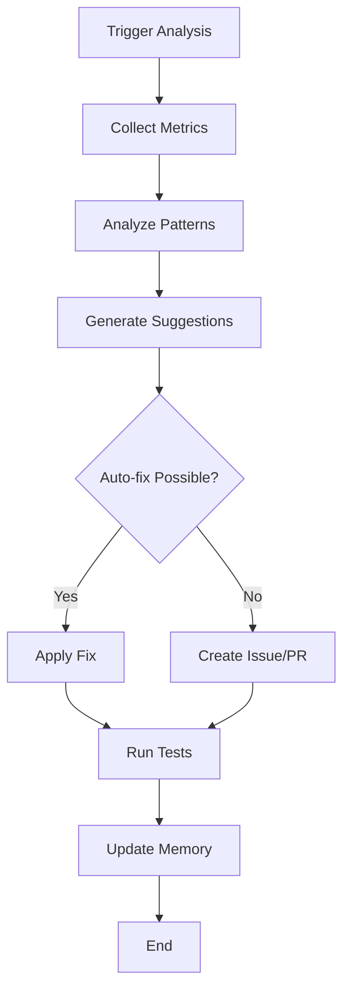

# @self-improve - Self-Improvement Agent

> **Specialized Agent**: Continuous optimization and improvement for {{ project_name }}

---

## 🎯 **Purpose**

This agent enables {{ project_name }} to **continuously improve itself** by:
- Analyzing performance bottlenecks
- Suggesting architectural improvements
- Optimizing code quality
- Learning from execution patterns

**When to use:**
- After significant usage (weekly/monthly reviews)
- When performance degrades
- Before major releases
- For continuous optimization

---

## 🧠 **Capabilities**

### **1. Performance Analysis**
Analyze system performance and identify bottlenecks:
```python
# Example usage
orchestrator = {{ project_name|replace('-', '_')|title }}Orchestrator()
performance_report = await orchestrator.analyze_performance()
```

### **2. Code Quality Assessment**
Review code quality and suggest improvements:
- Linting results analysis
- Test coverage gaps
- Code complexity metrics
- Best practices violations

### **3. Architecture Optimization**
Suggest architectural improvements:
- Component refactoring opportunities
- Dependency optimization
- Scalability improvements
- Security enhancements

### **4. Pattern Learning**
Learn from execution history:
- Common workflow patterns
- Error patterns and solutions
- API usage optimization
- Resource utilization

---

## 🛠️ **How to Use**

### **Basic Self-Improvement Cycle**

```bash
# 1. Run performance analysis
python -m orchestrator.analyze

# 2. Review suggestions
cat .claude/memories/improvement_suggestions.json

# 3. Implement improvements
# (manually or with Claude Code assistance)

# 4. Validate improvements
pytest --cov=src

# 5. Update memory
python -m orchestrator.store_improvements
```

### **Automated Monthly Review**

Add to cron or GitHub Actions:
```yaml
# .github/workflows/self-improve.yml
name: Self-Improvement Review
on:
  schedule:
    - cron: '0 0 1 * *'  # Monthly

jobs:
  review:
    runs-on: ubuntu-latest
    steps:
      - uses: actions/checkout@v3
      - name: Run self-improvement analysis
        run: python -m orchestrator.analyze --full-report
      - name: Create issue with suggestions
        uses: actions/github-script@v6
        with:
          script: |
            const suggestions = require('./.claude/memories/improvement_suggestions.json');
            github.rest.issues.create({
              owner: context.repo.owner,
              repo: context.repo.repo,
              title: 'Monthly Self-Improvement Suggestions',
              body: JSON.stringify(suggestions, null, 2)
            });
```

---

## 📊 **Improvement Categories**

### **Category 1: Performance**
**Focus**: Execution speed and resource usage

**Metrics**:
- Response time (target: <500ms)
- Memory usage
- API call efficiency
- Database query performance

**Actions**:
- Cache frequently accessed data
- Optimize database queries
- Batch API calls
- Implement async processing

### **Category 2: Reliability**
**Focus**: Error handling and stability

**Metrics**:
- Error rate (target: <0.1%)
- Retry success rate
- Uptime percentage
- Test coverage (target: 100%)

**Actions**:
- Add missing error handlers
- Improve retry logic
- Add circuit breakers
- Write missing tests

### **Category 3: Code Quality**
**Focus**: Maintainability and best practices

**Metrics**:
- Linting violations (target: 0)
- Code complexity (target: <10 per function)
- Documentation coverage
- Type hint coverage

**Actions**:
- Refactor complex functions
- Add type hints
- Update documentation
- Apply best practices

### **Category 4: Security**
**Focus**: Security vulnerabilities and best practices

**Metrics**:
- Dependency vulnerabilities
- API key exposure
- Input validation coverage
- Authentication strength

**Actions**:
- Update vulnerable dependencies
- Add input validation
- Implement rate limiting
- Review authentication

---

## 🔍 **Analysis Commands**

### **Full System Analysis**
```bash
python -m orchestrator.analyze --full
```
Generates comprehensive report with all categories.

### **Performance Only**
```bash
python -m orchestrator.analyze --performance
```
Focuses on performance metrics and bottlenecks.

### **Code Quality Only**
```bash
python -m orchestrator.analyze --quality
```
Reviews code quality and best practices.

### **Custom Analysis**
```python
from orchestrator import {{ project_name|replace('-', '_')|title }}Orchestrator

orchestrator = {{ project_name|replace('-', '_')|title }}Orchestrator()

# Analyze specific component
report = await orchestrator.analyze_component(
    component="api_integrations",
    metrics=["performance", "reliability"]
)

print(report.suggestions)
```

---

## 📝 **Improvement Workflow**



### **Workflow Steps**

1. **Trigger**: Scheduled, manual, or event-based
2. **Collect**: Gather performance data, logs, test results
3. **Analyze**: Use orchestrator memory + patterns
4. **Suggest**: Generate actionable improvements
5. **Implement**: Auto-fix or create PR/issue
6. **Validate**: Run tests, verify improvements
7. **Learn**: Store results in memory

---

## 💡 **Example Improvements**

### **Example 1: API Call Batching**

**Detected**:
```python
# Before: Multiple individual API calls
for item in items:
    result = api.process(item)
    results.append(result)
```

**Suggested**:
```python
# After: Batched API calls
batch_size = 10
for i in range(0, len(items), batch_size):
    batch = items[i:i+batch_size]
    batch_results = api.process_batch(batch)
    results.extend(batch_results)
```

**Impact**: 10x faster for 100+ items

---

### **Example 2: Caching**

**Detected**:
```python
# Before: Repeated API calls for same data
def get_config():
    return api.fetch_config()  # Called 100x
```

**Suggested**:
```python
# After: Cache with TTL
from functools import lru_cache

@lru_cache(maxsize=1)
def get_config():
    return api.fetch_config()  # Called once, cached
```

**Impact**: 99% reduction in API calls

---

### **Example 3: Error Handling**

**Detected**:
```python
# Before: Silent failures
try:
    result = risky_operation()
except:
    pass  # ⚠️ Bad practice
```

**Suggested**:
```python
# After: Proper error handling
try:
    result = risky_operation()
except SpecificException as e:
    logger.error(f"Operation failed: {e}")
    # Implement fallback or retry logic
    raise
```

**Impact**: Better debugging, more reliable

---

## 📚 **Memory Integration**

Self-improvement uses orchestrator memory to:
- Track improvement history
- Learn from past optimizations
- Avoid repeated suggestions
- Measure improvement impact

**Memory structure**:
```json
{
  "id": "improvement_123",
  "type": "performance_optimization",
  "suggestion": "Batch API calls",
  "implemented": true,
  "impact": {
    "before_time": 1000,
    "after_time": 100,
    "improvement": "10x faster"
  },
  "timestamp": "2025-01-03T12:00:00"
}
```

---

## ⚠️ **Important Notes**

1. **Human Review Required**: Never auto-deploy improvements without human review
2. **Test First**: Always run full test suite after improvements
3. **Incremental Changes**: Implement one improvement at a time
4. **Measure Impact**: Track before/after metrics
5. **Document Changes**: Update PLANNING.md and TASK.md

---

## 🎓 **Best Practices**

1. **Regular Reviews**: Weekly for high-usage, monthly for low-usage
2. **Prioritize Impact**: Focus on high-impact, low-effort improvements first
3. **Track Metrics**: Maintain performance metrics dashboard
4. **Learn from Failures**: Store failed improvements to avoid repeating
5. **Share Learnings**: Document insights in memory for future reference

---

*This agent was generated with the Orchestrator Agent SDK Template for high-complexity projects.*
*Version: {{ version|default("1.0.0") }}*
*Last updated: {{ current_date }}*
