# 📖 User Guide - Claude Code Template

> **Complete guide to mastering the hybrid AI system** - From basics to advanced project generation

**Prerequisites:** Complete [QUICK_START.md](../QUICK_START.md) first (10 minutes)

---

## 📚 Table of Contents

1. [Introduction & Architecture](#-introduction--architecture)
2. [Understanding the 11 Phases](#-understanding-the-11-phases)
3. [Mastering Checkpoints](#-mastering-checkpoints)
4. [TDD Workflow Deep Dive](#-tdd-workflow-deep-dive)
5. [Template System](#-template-system)
6. [Orchestrator SDK Usage](#-orchestrator-sdk-usage)
7. [Memory System](#-memory-system)
8. [Advanced Scenarios](#-advanced-scenarios)
9. [FAQ & Tips](#-faq--tips)

---

## 🎯 Introduction & Architecture

### What This Guide Provides

**QUICK_START.md** got you generating your first project in 10 minutes. **USER_GUIDE.md** teaches you to master the system:

- **Deep understanding** of the 11-phase workflow
- **Strategic use** of checkpoints (approve/fix/restart)
- **Advanced TDD** techniques for complex projects
- **Template customization** for your specific needs
- **Orchestrator SDK** integration (medium/high projects)
- **Memory system** for continuous learning

**After this guide**, you'll confidently generate production-ready projects for any automation need.

---

### Hybrid Architecture Overview

The template uses a **two-layer architecture** that combines interactive UX with structured analysis:

```mermaid
graph TD
    UserReq[👤 User Request<br/>'Automatizar procesamiento de facturas PDF']

    subgraph UXLayer[🎨 UX LAYER: @project-initializer]
        P0[Phase 0: Initialize Orchestrator]
        P1[Phase 1: Goal Understanding]
        P2[Phase 2: Intelligent Analysis<br/>orchestrator.analyze_intent<br/>orchestrator.get_memory_context]
        CP1{🔍 CHECKPOINT 1<br/>Research Validation<br/>ROI: 100x}
        P3to7[Phase 3-7: Planning & Analysis<br/>Tech Stack + Questions + Best Practices]
        CP2{📋 CHECKPOINT 2<br/>Planning Validation<br/>ROI: 10-20x}
        P8[Phase 8: TDD Implementation<br/>Tests FIRST → Code]
        P9[Phase 9: Final Validation]
        P10[Phase 10: Self-Improvement Setup]
    end

    subgraph EngineLayer[⚙️ ENGINE LAYER: Orchestrator SDK]
        Orchestrator[OrchestratorAgent]
        IntentAnalyzer[IntentAnalyzer<br/>Pydantic Models]
        MemoryMgr[MemoryManager<br/>Shared .claude/memories/]
        ProjGen[ProjectGenerator]
        SubAgents[5 Specialized Subagents]
        MCPTools[Custom MCP Tools]
    end

    GenProject[📦 GENERATED PROJECT<br/>src/ + tests/ + docs/<br/>orchestrator/ medium/high<br/>@self-improve medium/high]

    UserReq --> P0
    P0 --> P1
    P1 --> P2
    P2 --> CP1

    CP1 -->|approve| P3to7
    CP1 -->|fix| P2
    CP1 -->|restart| P1

    P3to7 --> CP2

    CP2 -->|approve| P8
    CP2 -->|fix| P3to7
    CP2 -->|back to research| P2

    P8 --> P9
    P9 --> P10
    P10 --> GenProject

    UXLayer <-->|uses internally| EngineLayer

    Orchestrator --> IntentAnalyzer
    Orchestrator --> MemoryMgr
    Orchestrator --> ProjGen
    Orchestrator --> SubAgents
    Orchestrator --> MCPTools

    style CP1 fill:#ff6b6b,stroke:#c92a2a,color:#fff
    style CP2 fill:#4dabf7,stroke:#1971c2,color:#fff
    style UserReq fill:#51cf66,stroke:#2f9e44,color:#fff
    style GenProject fill:#ffd43b,stroke:#f59f00,color:#000
```



**Key Components:**

1. **UX Layer** (@project-initializer):
   - Interactive guided experience
   - 11 phases with clear progression
   - 2 human validation checkpoints
   - Real-time feedback and guidance

2. **Engine Layer** (Orchestrator SDK):
   - Structured intent analysis (Pydantic models)
   - Persistent memory system
   - Specialized subagents (requirements, code, tests, docs, validator)
   - Custom MCP tools for project generation

3. **Why Hybrid?**
   - **UX Layer**: Makes system approachable, guides users step-by-step
   - **Engine Layer**: Ensures quality, consistency, and learning
   - **Together**: Best of both worlds - usable AND powerful

---

### Why 11 Phases?

**Separation of Concerns**: Each phase has a specific purpose and output.

- **Phases 0-2**: Research & Goal Understanding → CHECKPOINT 1
- **Phases 3-7**: Planning & Technical Design → CHECKPOINT 2
- **Phases 8-10**: Implementation & Validation → Generated Project

**Benefits:**
- Clear progress indicators ("Currently in Phase 5...")
- Easy to debug ("Error in Phase 3? Let's review tech stack")
- Modular workflow (can improve individual phases independently)

---

### Why 2 Checkpoints?

**Error Impact Hierarchy** (from BAML team):

```
Research error  = 1,000 bad lines of code
Plan error      = 10-100 bad lines of code
Code error      = 1 bad line
```

**CHECKPOINT 1** (after Research):
- **ROI**: 2-5 minutes → prevents 1,000 bad lines (100x ROI)
- **When**: After Phase 2 (Intelligent Analysis)
- **Purpose**: Validate APIs identified, complexity level, project understanding

**CHECKPOINT 2** (after Planning):
- **ROI**: 3-5 minutes → prevents 10-100 bad lines (10-20x ROI)
- **When**: After Phase 7 (Plan Formulation)
- **Purpose**: Validate implementation plan, test definitions, scope

**Why NOT checkpoint after code?**
- Code errors are caught by TDD tests (automatic verification)
- Human review of code is low ROI (tests do it better)
- Review the TESTS instead (much more valuable)

---

### Why TDD?

**Test-Driven Development** reduces human review by **80%**:

1. **Tests define behavior FIRST** → Clear specification
2. **Code makes tests pass** → Automatic verification
3. **Passing tests = working code** → No manual checking needed

**Traditional approach:**
```
Write code → Hope it works → Manual testing → Find bugs → Fix → Repeat
```

**TDD approach:**
```
Write failing test → Implement → Test passes ✅ → Done
```

**Result**: Faster, more reliable, less human time spent reviewing.

---

## 🔄 Understanding the 11 Phases

This section provides a **detailed walkthrough** of each phase, what happens, why it exists, and what you should expect.

---

### Phase 0: Initialize Orchestrator

**Purpose:** Internal setup of the Orchestrator SDK engine.

**Duration:** 5-10 seconds (automatic, no user interaction)

**User Interaction:** None - happens behind the scenes when you invoke `@project-initializer`

**What Happens:**
```python
orchestrator = OrchestratorAgent()
# Loads memory system
# Initializes Pydantic models
# Prepares subagents
# Checks component availability
```

**Output:**
```
✅ Orchestrator SDK initialized
✅ Version: 1.0.0
✅ Memory system ready
✅ All components available
```

**Tips:**
- If you see errors here, check `ANTHROPIC_API_KEY` is set
- Check `pip install -r requirements.txt` was successful
- See [TROUBLESHOOTING.md](TROUBLESHOOTING.md) if initialization fails

---

### Phase 1: Goal Understanding

**Purpose:** Clarify what you want to build through interactive Q&A.

**Duration:** 2-5 minutes (depends on project complexity)

**User Interaction:** HIGH - Answer questions about your automation goal

**What Happens:**

1. Agent asks for your goal:
   ```
   🎯 What automation project do you want to create?
   ```

2. You describe it (natural language):
   ```
   I want to automate reading emails from Gmail and saving them to Notion
   ```

3. Agent asks clarifying questions:
   ```
   📋 To better understand your needs:

   1. Which Gmail labels/folders should I monitor?
   2. What information from emails do you want in Notion?
   3. How often should it check for new emails?
   4. Do you need OAuth authentication setup?
   ```

4. You answer each question

**Output:** Clear, specific project goal understood by both you and the agent

**Tips:**
- **Be specific**: "Monitor 'Important' label" > "Monitor Gmail"
- **Mention integrations**: "Gmail API and Notion API" helps agent
- **State frequency**: "Every 5 minutes" vs "Real-time" affects architecture
- **Don't worry about technical details yet**: Agent will figure out tech stack

**Example Good Goal:**
```
Automate syncing new emails from Gmail's "Client Requests" label to a Notion database,
running every 10 minutes, including sender, subject, date, and body text.
```

**Example Too Vague:**
```
Connect Gmail to Notion
```

---

### Phase 2: Intelligent Analysis (HYBRID)

**Purpose:** Structured analysis of your goal using orchestrator + parallel agents.

**Duration:** 2-3 minutes (automatic, some visible progress)

**User Interaction:** LOW - Watch progress, no input needed

**What Happens:**

1. **Orchestrator Intent Analysis:**
   ```python
   intent = orchestrator.analyze_intent(user_goal)
   # Returns AutomationIntent (Pydantic model):
   # - project_name
   # - project_type
   # - apis_required
   # - complexity (simple/medium/high)
   # - tech_stack_recommendation
   ```

2. **Memory Context Retrieval:**
   ```python
   memory_context = orchestrator.get_memory_context(intent.project_type)
   # Retrieves learned patterns from previous projects
   # "Other Gmail integrations used google-auth library..."
   ```

3. **Parallel Agents Research:**
   - **Sequential-thinking agent**: Analyzes architecture options
   - **Library-researcher agent**: Finds best libraries for APIs
   - **Codebase-analyst agent**: Reviews similar patterns

**Output:** Comprehensive research summary presented at CHECKPOINT 1

**What You See:**
```
🔍 Analyzing your automation goal...
   ├─ Intent analysis: gmail-to-notion integration
   ├─ Complexity assessment: MEDIUM
   ├─ APIs identified: Gmail API, Notion API
   ├─ Memory retrieval: 3 similar projects found
   ├─ Library research: google-api-python-client, notion-client
   └─ Architecture analysis: Polling strategy recommended

⏱️  Analysis complete (2m 15s)
```

**Tips:**
- This phase uses **most context window** - agent is thinking hard
- If analysis seems off, you'll catch it at CHECKPOINT 1
- Memory context improves over time as you generate more projects

---

### Phase 3: Tech Stack Determination

**Purpose:** Select specific technologies, libraries, and frameworks.

**Duration:** 1-2 minutes (automatic)

**User Interaction:** None - agent decides based on intent

**What Happens:**

Agent determines:
- **Programming language** (usually Python for automation)
- **APIs and SDKs** (gmail API, notion SDK, etc.)
- **Authentication method** (OAuth 2.0, API keys, etc.)
- **Storage/Database** (if needed)
- **Deployment target** (local script, cloud function, etc.)

**Output:**
```
📦 Tech Stack Selected:
   Language: Python 3.10+
   APIs:
     - Gmail API (google-api-python-client)
     - Notion API (notion-client)
   Auth: OAuth 2.0 for both
   Storage: Notion database (no additional DB needed)
   Deployment: Local Python script (cron job)
   Additional: python-dotenv, pytest, ruff
```

**Tips:**
- Agent uses memory from similar projects
- Tech stack shown in CHECKPOINT 2 - you can request changes there
- Decisions are based on best practices for the specific APIs

---

### Phase 4: Follow-up Questions

**Purpose:** Fill gaps in understanding with context-specific questions.

**Duration:** 1-3 minutes (depends on project)

**User Interaction:** MEDIUM - Answer additional questions

**What Happens:**

Agent asks questions specific to your tech stack:

**For OAuth projects:**
```
🔐 OAuth Configuration:
1. Do you already have Google Cloud project credentials?
2. Have you enabled Gmail API in Google Cloud Console?
3. Do you have Notion integration token?
```

**For data processing:**
```
📊 Data Handling:
1. Should we filter emails by sender/subject?
2. How to handle duplicate emails in Notion?
3. What should happen if Notion API fails?
```

**Output:** Complete understanding of setup requirements

**Tips:**
- Answer honestly - "No, I don't have credentials yet" is fine
- Agent will guide setup in Phase 8 (TDD Implementation)
- These answers affect test definitions

---

### Phase 5: Best Practices Research

**Purpose:** Research industry best practices for your specific integrations.

**Duration:** 1-2 minutes (automatic)

**User Interaction:** None

**What Happens:**

Agent researches:
- **API rate limits** (Gmail: 250 quota units/user/second)
- **Error handling** patterns (exponential backoff)
- **Security** best practices (OAuth token storage)
- **Performance** optimizations (batch API calls)
- **Testing** strategies (mocking external APIs)

**Output:**
```
✨ Best Practices Identified:
   ✅ Implement exponential backoff for API errors
   ✅ Use OAuth refresh tokens (avoid re-auth)
   ✅ Batch Notion page creation (max 100/request)
   ✅ Store tokens in encrypted .env file
   ✅ Mock APIs in tests (don't call real Gmail/Notion)
   ✅ Log all API calls for debugging
```

**Tips:**
- These practices are **automatically applied** in generated code
- Memory system stores new best practices for future projects
- You don't need to know these - agent handles it

---

### Phase 6: Code Analysis

**Purpose:** Analyze existing template code and patterns for similar projects.

**Duration:** 1-2 minutes (automatic)

**User Interaction:** None

**What Happens:**

Agent uses **@codebase-analyst** to:
1. Find similar integration patterns in template
2. Identify reusable code structures
3. Extract naming conventions
4. Review test patterns

**Example Analysis:**
```
📂 Codebase Analysis:
   Found: 2 similar Gmail integration patterns

   Pattern 1: gmail_oauth_client.py
   - OAuth flow implementation
   - Token refresh logic
   - Error handling with retries

   Pattern 2: api_client_base.py
   - Rate limiting decorator
   - Logging wrapper
   - Async request handling

   Recommendation: Reuse oauth flow, customize for Notion
```

**Output:** Code patterns and structures for implementation

**Tips:**
- First project won't find much (empty template)
- Future projects benefit from accumulated patterns
- Memory system stores successful patterns

---

### Phase 7: Plan Formulation

**Purpose:** Create detailed implementation plan with TDD test definitions.

**Duration:** 2-3 minutes (automatic)

**User Interaction:** None - plan created automatically

**What Happens:**

Agent creates comprehensive plan:

1. **File structure:**
   ```
   src/gmail_client.py
   src/notion_client.py
   src/sync_engine.py
   tests/test_gmail_client.py
   tests/test_notion_client.py
   tests/test_sync_engine.py
   ```

2. **Test definitions (TDD - tests FIRST):**
   ```python
   def test_gmail_oauth_flow()
   def test_fetch_emails_from_label()
   def test_notion_database_creation()
   def test_notion_page_creation()
   def test_sync_engine_end_to_end()
   def test_rate_limiting()
   ```

3. **Implementation order:**
   ```
   1. Gmail OAuth → test → code
   2. Fetch emails → test → code
   3. Notion DB setup → test → code
   4. Notion page creation → test → code
   5. Sync engine → test → code
   6. Rate limiting → test → code
   ```

4. **Scope control ("What we're NOT doing"):**
   ```
   ❌ Email sending (read-only)
   ❌ Notion → Gmail sync (one-way)
   ❌ Real-time webhooks (polling only)
   ❌ Attachment handling (text only)
   ```

**Output:** Complete plan presented at CHECKPOINT 2

**Tips:**
- Scope control prevents feature creep
- Tests defined BEFORE code (TDD principle)
- Implementation order optimized for dependencies

---

### Phase 8: TDD Implementation

**Purpose:** Generate project code using Test-Driven Development.

**Duration:** 5-15 minutes (depends on complexity and API setup time)

**User Interaction:** HIGH - Confirm setups, provide credentials, approve each feature

**What Happens:**

**Step 8.0:** Decide orchestrator inclusion
```python
if complexity == "medium" or complexity == "high":
    include_orchestrator = True
    # Will copy orchestrator/ to generated project
    # Will create @self-improve agent
```

**Step 8.1:** Create base structure
```
Creating project: gmail-to-notion-sync/
✅ src/ directory
✅ tests/ directory
✅ .claude/ directory
✅ orchestrator/ (MEDIUM complexity)
✅ @self-improve.md (MEDIUM complexity)
✅ README.md, CLAUDE.md, PLANNING.md, TASK.md
✅ requirements.txt, .env.example
✅ .gitignore
```

**Step 8.2:** Define Test Suite FIRST (all failing)
```python
# Agent writes ALL tests before any implementation code
# Tests currently FAIL (expected - no code exists yet)

Created tests/test_gmail_client.py:
  ❌ test_gmail_oauth_flow (GmailClient not found)
  ❌ test_fetch_emails_from_label (method not implemented)

Created tests/test_notion_client.py:
  ❌ test_notion_database_creation (NotionClient not found)
  ❌ test_notion_page_creation (method not implemented)

Created tests/test_sync_engine.py:
  ❌ test_sync_engine_end_to_end (SyncEngine not found)
  ❌ test_rate_limiting (decorator not implemented)
```

**Step 8.3:** TDD Loop for EACH feature

See detailed [TDD Workflow Deep Dive](#-tdd-workflow-deep-dive) section below.

**Output:** Complete project with 100% test coverage

**Tips:**
- **Don't skip setups** - agent guides you through OAuth, API keys, etc.
- **Watch tests turn green** - satisfying and confirms working code
- **Pause anytime** - respond "no" to "Ready for next feature?"
- **Tests are your safety net** - they prove code works

---

### Phase 9: Final Validation

**Purpose:** End-to-end validation and quality checks.

**Duration:** 1-2 minutes (automatic)

**User Interaction:** None

**What Happens:**

Agent runs comprehensive validation:

1. **Test suite:**
   ```bash
   pytest tests/ -v
   ✅ 6/6 tests passing
   ✅ Coverage: 100%
   ```

2. **Linting:**
   ```bash
   ruff check .
   ✅ 0 errors, 0 warnings
   ```

3. **Type checking:**
   ```bash
   mypy src/
   ✅ Success: no issues found
   ```

4. **Documentation completeness:**
   ```
   ✅ README.md complete
   ✅ CLAUDE.md complete
   ✅ All functions have docstrings
   ✅ .env.example has all required variables
   ```

5. **Quality score calculation:**
   ```
   📊 Quality Metrics:
      Test Coverage: 100% ✅
      Linting: 0 errors ✅
      Type Hints: 100% ✅
      Documentation: Complete ✅

   🎯 Quality Score: 9.5/10
   ```

**Output:** Quality report and recommendations

**Tips:**
- Score <8.0 indicates issues - agent will suggest fixes
- All metrics should be green before moving to Phase 10
- Quality report saved in project for future reference

---

### Phase 10: Self-Improvement Setup

**Purpose:** Enable generated project to self-improve over time (medium/high complexity only).

**Duration:** 1-2 minutes (automatic)

**User Interaction:** None

**What Happens:**

**For MEDIUM/HIGH complexity projects:**

1. **Create @self-improve agent:**
   ```markdown
   .claude/agents/@self-improve.md created

   Agent capabilities:
   - Analyze project performance metrics
   - Suggest optimizations
   - Identify code smells
   - Propose refactorings
   - Learn from usage patterns
   ```

2. **Store architectural decisions:**
   ```python
   orchestrator.memory.store_architectural_decision(
       decision="Used polling over webhooks",
       context="Gmail API webhooks require domain verification",
       rationale="Polling simpler for local deployment"
   )
   ```

3. **Store successful patterns:**
   ```python
   orchestrator.memory.store_pattern(
       pattern_name="gmail_oauth_flow",
       description="OAuth 2.0 flow with token refresh",
       code_example=gmail_client.py
   )
   ```

**For SIMPLE complexity projects:**
- Skip this phase (no orchestrator included)
- Project is complete and ready to use

**Output:**
```
✅ Project generated successfully!

📂 Location: /path/to/gmail-to-notion-sync/

🎯 Quality Score: 9.5/10
✅ 100% test coverage
✅ Self-improvement enabled (MEDIUM complexity)

📝 Next steps:
1. cd gmail-to-notion-sync
2. Review README.md for setup
3. Run: python src/sync_engine.py
```

**Tips:**
- **@self-improve agent** can be invoked later: `@self-improve analyze performance`
- **Memories stored** help future projects with similar integrations
- **Review learnings** in `.claude/memories/` directory

---

## 🔍 Mastering Checkpoints

Checkpoints are **critical decision points** where you validate the agent's work before expensive implementation.

### Checkpoint Decision Framework

```mermaid
graph TD
    CP[Checkpoint Reached] --> Q{Review Summary}
    Q -->|Everything correct| A[✅ approve]
    Q -->|Minor issues| F{Can be fixed<br/>easily?}
    Q -->|Fundamental problems| R[❌ restart or<br/>back to research]

    F -->|Yes| FIX[🔄 fix: description]
    F -->|No| R

    A --> Next[Proceed to<br/>next phase]
    FIX --> Correct[Agent corrects]
    Correct --> Recheck[Review again]
    Recheck --> Q

    R --> Rethink[Deep rethink]
    Rethink --> Start[Start from<br/>earlier phase]

    style A fill:#51cf66,stroke:#2f9e44,color:#fff
    style FIX fill:#4dabf7,stroke:#1971c2,color:#fff
    style R fill:#ff6b6b,stroke:#c92a2a,color:#fff
```



---

### CHECKPOINT 1: Research Validation

**When:** After Phase 2 (Intelligent Analysis)

**ROI:** 100x (2-5 minutes → prevents 1,000 bad lines)

**What You See:**

```
🔍 CHECKPOINT 1: Research Validation (CRITICAL - Human Review Required)

━━━━━━━━━━━━━━━━━━━━━━━━━━━━━━━━━━━━━━━━━━━━━━━━━━━━━━━━

📊 RESEARCH SUMMARY

Project: gmail-to-notion-sync
Type: API Integration (Medium Complexity)
APIs Required: Gmail API, Notion API

Key Findings:
- Gmail API: google-auth + google-api-python-client
- Notion API: notion-client library
- OAuth 2.0 flow needed for both
- Polling strategy: 5-min intervals with rate limiting
- Storage: Notion database for emails

Estimated Complexity: MEDIUM
- Will include: orchestrator/ + @self-improve agent
- Test coverage: 100% (TDD approach)
- Context window projection: ~35% (well under 50% target)

━━━━━━━━━━━━━━━━━━━━━━━━━━━━━━━━━━━━━━━━━━━━━━━━━━━━━━━━

❓ VALIDATION QUESTIONS

1. Is the project name "gmail-to-notion-sync" appropriate?
2. Are Gmail API and Notion API the correct integrations?
3. Is MEDIUM complexity accurate for your skill level?
4. Is 35% context window acceptable (<50% target)?
5. Did I capture your intention correctly?
6. Is this checkpoint valuable before planning?

━━━━━━━━━━━━━━━━━━━━━━━━━━━━━━━━━━━━━━━━━━━━━━━━━━━━━━━━

⏸️  YOUR RESPONSE REQUIRED:

✅ "approve"                    → Proceed to Planning Phase
🔄 "fix: [description]"        → Make corrections to research
❌ "restart"                    → Research fundamentally wrong
```

#### When to "approve"

✅ **Good reasons to approve:**
- APIs identified are correct for your goal
- Complexity level matches your skills
- Project name makes sense
- No critical missing requirements
- Context window <50%
- Research captured your intention

**Example:**
```
approve
```

#### When to "fix"

🔄 **Good reasons to fix:**
- Minor API missing (e.g., "also need Slack API")
- Complexity level too high/low
- Better project name suggestion
- Additional requirement clarification

**Examples:**
```
fix: Also need Slack API for notifications
```

```
fix: Change complexity to SIMPLE - I only want basic sync
```

```
fix: Project name should be "client-email-tracker"
```

**What happens:** Agent re-runs relevant parts of Phase 2 with your corrections, then presents updated research for approval again.

#### When to "restart"

❌ **Good reasons to restart:**
- Agent completely misunderstood your goal
- Wrong type of project (you wanted web app, got CLI script)
- Missing fundamental integration
- Research went in wrong direction

**Examples:**
```
restart
```

Agent will ask: "What was fundamentally misunderstood?"

You clarify:
```
I want to sync Notion TO Gmail (reverse direction), not Gmail to Notion
```

**What happens:** Agent starts from Phase 1 (Goal Understanding) with new context.

#### CHECKPOINT 1 Strategies

**Strategy 1: Quick Scan** (experienced users)
- Skim research summary (30 seconds)
- Check APIs list
- Verify complexity
- If good: `approve`

**Strategy 2: Detailed Review** (first-time users)
- Read entire summary
- Answer all 6 validation questions mentally
- Check context window projection
- Consider edge cases
- If unsure: ask questions in chat before responding

**Strategy 3: Iterative Refinement**
- Approve if 80% correct
- Fix remaining 20% in later phases
- Use CHECKPOINT 2 for final adjustments

**Common Mistakes:**
- ❌ Approving when complexity is clearly wrong
- ❌ Restarting for minor fixes (use "fix" instead)
- ❌ Not checking context window projection
- ❌ Rushing through validation

---

### CHECKPOINT 2: Planning Validation

**When:** After Phase 7 (Plan Formulation)

**ROI:** 10-20x (3-5 minutes → prevents 10-100 bad lines)

**What You See:**

```
📋 CHECKPOINT 2: Planning Validation (CRITICAL - Human Review Required)

━━━━━━━━━━━━━━━━━━━━━━━━━━━━━━━━━━━━━━━━━━━━━━━━━━━━━━━━

📐 IMPLEMENTATION PLAN

Phase 8.1: Create Base Structure
- src/gmail_client.py
- src/notion_client.py
- src/sync_engine.py
- tests/ with 100% coverage
- .claude/ with agents + memories
- orchestrator/ (MEDIUM complexity)
- @self-improve agent (auto-evolution)

Phase 8.2: Define Test Suite FIRST (TDD)
✅ test_gmail_oauth_flow()
✅ test_fetch_emails_from_label()
✅ test_notion_database_creation()
✅ test_notion_page_creation()
✅ test_sync_engine_end_to_end()
✅ test_rate_limiting()

Phase 8.3: TDD Loop (5 steps per test)
1. Show failing test
2. Guide OAuth setup (credentials.json)
3. Implement feature
4. Run test → PASS ✅
5. Confirm → Next feature

Tech Stack:
- Python 3.10+
- google-auth, google-api-python-client
- notion-client
- pytest, pytest-cov
- python-dotenv

What We're NOT Doing (Scope Control):
❌ Email sending (only reading)
❌ Notion → Gmail sync (one-way only)
❌ Real-time webhooks (polling only)
❌ Email attachments (text only)

━━━━━━━━━━━━━━━━━━━━━━━━━━━━━━━━━━━━━━━━━━━━━━━━━━━━━━━━

❓ VALIDATION QUESTIONS

1. Are phases clear with specific file names?
2. Are tests defined BEFORE implementation (TDD)?
3. Is orchestrator correctly included (MEDIUM complexity)?
4. Is scope clear (what we're NOT doing)?
5. Are verification steps (5-step TDD loop) included?
6. Is context window projection <50% for implementation?
7. Is this checkpoint valuable before coding?

━━━━━━━━━━━━━━━━━━━━━━━━━━━━━━━━━━━━━━━━━━━━━━━━━━━━━━━━

⏸️  YOUR RESPONSE REQUIRED:

✅ "approve"                    → Begin TDD Implementation
🔄 "fix: [description]"        → Adjust plan
❌ "back to research"          → Plan reveals research was wrong
```

#### When to "approve"

✅ **Good reasons to approve:**
- Test definitions cover your requirements
- File structure makes sense
- Scope control accurately excludes out-of-scope features
- TDD loop is clear
- Tech stack is appropriate
- Implementation order is logical

**Example:**
```
approve
```

#### When to "fix"

🔄 **Good reasons to fix:**
- Missing test for important feature
- File structure could be better organized
- Scope needs adjustment (add/remove feature)
- Tech stack has better alternative

**Examples:**
```
fix: Add test_email_deduplication() to handle duplicate emails
```

```
fix: Include email attachments in scope - I need that feature
```

```
fix: Use 'requests' instead of httpx for simpler dependency
```

**What happens:** Agent adjusts plan with your corrections, then presents updated plan for approval again.

#### When to "back to research"

❌ **Good reasons to go back:**
- Plan reveals research missed critical API
- Complexity should have been different
- Architecture approach is fundamentally wrong

**Examples:**
```
back to research
```

Agent asks: "What did the planning process reveal was wrong?"

You clarify:
```
The plan shows we need Webhooks API which wasn't in research. Research complexity was wrong.
```

**What happens:** Agent goes back to Phase 2 (Research) with new context, then through planning again, reaching CHECKPOINT 1 → CHECKPOINT 2 again.

#### CHECKPOINT 2 Strategies

**Strategy 1: Test-First Review** (recommended)
1. Read test definitions first
2. Check if tests cover all your requirements
3. Review file structure
4. Check scope ("What we're NOT doing")
5. If tests are comprehensive: `approve`

**Strategy 2: Scope Control Focus**
1. Jump to "What we're NOT doing"
2. Verify exclusions are correct
3. Add missing features if needed via "fix"
4. Then review rest of plan

**Strategy 3: Mental Walkthrough**
- Imagine implementing each test
- Does the order make sense?
- Are setups realistic?
- Would YOU write these tests?
- If yes: `approve`

**Common Mistakes:**
- ❌ Not reading "What we're NOT doing" (scope creep later)
- ❌ Approving without checking test completeness
- ❌ Going "back to research" for plan-level fixes (use "fix")
- ❌ Not considering implementation complexity

---

### Checkpoint Best Practices

1. **Take Your Time**
   - CHECKPOINT 1: 2-5 min recommended
   - CHECKPOINT 2: 3-5 min recommended
   - ROI is massive - worth the investment

2. **Read Out Loud**
   - Hearing yourself read summary catches errors
   - Slows you down (good thing)

3. **Ask "What If?"**
   - "What if this API is rate-limited?"
   - "What if authentication fails?"
   - "What if Notion database doesn't exist?"
   - Plan should address these

4. **Trust Your Gut**
   - Something feels off? Use "fix"
   - Unclear? Ask questions in chat
   - Confident? `approve`

5. **Don't Fear Iteration**
   - "fix" → adjust → review again is normal
   - Better than approving and regretting later
   - Iteration is FAST (30 seconds)

6. **Learn from Previous Projects**
   - Did you miss something last time?
   - Add that check to your checkpoint review
   - Build personal checklist

---

## 🧪 TDD Workflow Deep Dive

Test-Driven Development is **mandatory** in this template. Here's why and how.

### Why Tests FIRST?

**Problem with Code-First:**
```
Write code → Hope it works → Manual testing → Find bugs → Fix → Repeat
Time: 2 hours    ROI: Low    Confidence: 60%
```

**TDD Approach:**
```
Write test → Implement → Test passes → Done
Time: 30 minutes    ROI: High    Confidence: 100%
```

**Benefits:**

1. **Tests Define Behavior**: Clear spec before coding
2. **Automatic Verification**: No guessing if code works
3. **Prevents Scope Creep**: Test defines scope exactly
4. **Refactor Safely**: Tests catch regressions
5. **80% Less Human Review**: Tests do the validation
6. **100% Coverage**: Guaranteed (tests exist for all code)

---

### The 5-Step TDD Loop

```mermaid
graph LR
    A[🔴 1. Failing Test<br/>RED] --> B[📋 2. Guide Setup<br/>Credentials/Config]
    B --> C[⚙️ 3. Implement<br/>Code]
    C --> D[✅ 4. Test PASS<br/>GREEN]
    D --> E{5. Confirm}
    E -->|🔄 Refactor| C
    E -->|➡️ Next Feature| A
    E -->|✅ All Done| F[🎯 100% Coverage<br/>Complete]

    style A fill:#ff6b6b,stroke:#c92a2a,color:#fff
    style D fill:#51cf66,stroke:#2f9e44,color:#fff
    style F fill:#ffd43b,stroke:#f59f00,color:#000
```



This loop repeats for **EACH feature** until all tests pass.

---

### Step 1: Failing Test (RED)

**What Happens:**

Agent shows you a failing test:

```python
━━━━━━━━━━━━━━━━━━━━━━━━━━━━━━━━━━━━━━━━━━━━━━━━━━━━━━━━
🔴 STEP 1: Failing Test

Running: tests/test_gmail_client.py::test_gmail_oauth_flow

FAILED tests/test_gmail_client.py::test_gmail_oauth_flow

ImportError: cannot import name 'GmailClient' from 'src.gmail_client'

Expected: Successful OAuth authentication
Actual: Class doesn't exist yet

━━━━━━━━━━━━━━━━━━━━━━━━━━━━━━━━━━━━━━━━━━━━━━━━━━━━━━━━

Test code:
```python
def test_gmail_oauth_flow():
    """Test Gmail OAuth 2.0 authentication flow"""
    client = GmailClient(credentials_path="credentials.json")
    assert client.is_authenticated() == True
    assert client.service is not None
```

This test DEFINES the requirement:
- GmailClient class must exist
- Constructor accepts credentials_path
- Has is_authenticated() method
- Has service attribute after auth
```

**What You Do:** Read and understand what's being tested

**Tips:**
- **Test is the spec**: Implementation must match this exact interface
- **Failing is GOOD**: Means test works (catches missing code)
- **Read carefully**: Implementation will be based on this

---

### Step 2: Guide Setup

**What Happens:**

Agent guides you through any required setup:

```
━━━━━━━━━━━━━━━━━━━━━━━━━━━━━━━━━━━━━━━━━━━━━━━━━━━━━━━━
📋 STEP 2: Setup Guidance

To implement Gmail OAuth, you need:

1. Create Google Cloud Project:
   - Go to console.cloud.google.com
   - Create new project "gmail-notion-sync"

2. Enable Gmail API:
   - In project dashboard
   - Click "Enable APIs and Services"
   - Search "Gmail API"
   - Click "Enable"

3. Create OAuth 2.0 Credentials:
   - Go to "Credentials" tab
   - Click "Create Credentials" → "OAuth client ID"
   - Application type: "Desktop app"
   - Name: "Gmail Notion Sync"

4. Download Credentials:
   - Click download icon (JSON)
   - Save as `credentials.json` in project root

5. Add to .env:
   ```bash
   GMAIL_CREDENTIALS_PATH=credentials.json
   ```

Ready to continue? (yes/no)
━━━━━━━━━━━━━━━━━━━━━━━━━━━━━━━━━━━━━━━━━━━━━━━━━━━━━━━━
```

**What You Do:**
- Follow instructions step-by-step
- Obtain credentials/API keys
- Configure environment
- Respond: `yes` when ready

**Tips:**
- **Don't skip steps**: Each is required for test to pass
- **Save credentials securely**: Use .env, never commit to git
- **Ask questions**: If stuck, ask agent for help
- **Take your time**: No rush - setup is critical

---

### Step 3: Implement Code

**What Happens:**

Agent implements the code to make the test pass:

```
━━━━━━━━━━━━━━━━━━━━━━━━━━━━━━━━━━━━━━━━━━━━━━━━━━━━━━━━
⚙️  STEP 3: Implementation

Creating src/gmail_client.py...

```python
from google.oauth2.credentials import Credentials
from google_auth_oauthlib.flow import InstalledAppFlow
from googleapiclient.discovery import build
from typing import Optional

class GmailClient:
    """Gmail API client with OAuth 2.0 authentication"""

    SCOPES = ['https://www.googleapis.com/auth/gmail.readonly']

    def __init__(self, credentials_path: str):
        """Initialize Gmail client with OAuth credentials

        Args:
            credentials_path: Path to credentials.json file
        """
        self.credentials_path = credentials_path
        self.service: Optional[Any] = None
        self._authenticate()

    def _authenticate(self) -> None:
        """Perform OAuth 2.0 authentication"""
        flow = InstalledAppFlow.from_client_secrets_file(
            self.credentials_path,
            self.SCOPES
        )
        creds = flow.run_local_server(port=0)
        self.service = build('gmail', 'v1', credentials=creds)

    def is_authenticated(self) -> bool:
        """Check if client is authenticated"""
        return self.service is not None
```

✅ Code created (45 lines)
━━━━━━━━━━━━━━━━━━━━━━━━━━━━━━━━━━━━━━━━━━━━━━━━━━━━━━━━
```

**What You Do:** Review the implementation (optional - tests will verify it)

**Tips:**
- **Code matches test interface**: Constructor, methods, attributes
- **Agent follows best practices**: Error handling, type hints, docstrings
- **You don't need to verify manually**: Next step does that

---

### Step 4: Test PASS (GREEN)

**What Happens:**

Agent runs the test again:

```
━━━━━━━━━━━━━━━━━━━━━━━━━━━━━━━━━━━━━━━━━━━━━━━━━━━━━━━━
✅ STEP 4: Test Passes

Running: tests/test_gmail_client.py::test_gmail_oauth_flow

PASSED tests/test_gmail_client.py::test_gmail_oauth_flow ✅

Output:
  Authentication successful
  Service created: <googleapiclient.discovery.Resource object>
  is_authenticated() returned: True

Test Duration: 2.3s
Coverage: src/gmail_client.py - 100%

━━━━━━━━━━━━━━━━━━━━━━━━━━━━━━━━━━━━━━━━━━━━━━━━━━━━━━━━

🎉 Feature Complete: Gmail OAuth Flow

This test now serves as:
✅ Specification (defines exact behavior)
✅ Verification (proves code works)
✅ Safety net (will catch future breaks)
✅ Documentation (shows how to use GmailClient)

━━━━━━━━━━━━━━━━━━━━━━━━━━━━━━━━━━━━━━━━━━━━━━━━━━━━━━━━
```

**What You Do:** Celebrate! 🎉 Feature is DONE and PROVEN to work

**Tips:**
- **Green = Done**: No manual verification needed
- **Coverage 100%**: All code is tested
- **Test is permanent**: Will catch regressions forever

---

### Step 5: Confirm & Next

**What Happens:**

Agent asks what's next:

```
━━━━━━━━━━━━━━━━━━━━━━━━━━━━━━━━━━━━━━━━━━━━━━━━━━━━━━━━
🎯 STEP 5: Confirmation

Current Progress:
✅ test_gmail_oauth_flow (DONE)
⬜ test_fetch_emails_from_label (NEXT)
⬜ test_notion_database_creation
⬜ test_notion_page_creation
⬜ test_sync_engine_end_to_end
⬜ test_rate_limiting

Next Feature: Fetch Emails from Label

Options:
1. "yes" → Continue to next feature (fetch emails)
2. "refactor" → Improve current code (test still passes)
3. "no" → Pause implementation (can resume later)

Your choice?
━━━━━━━━━━━━━━━━━━━━━━━━━━━━━━━━━━━━━━━━━━━━━━━━━━━━━━━━
```

**What You Do:** Respond with your choice

**Options:**

1. **"yes"** → Most common, continue to next feature
2. **"refactor"** → Improve code (e.g., extract helper method, rename variable)
3. **"no"** → Pause (need break, want to test manually, etc.)

**Tips:**
- **Usually say "yes"**: Keep momentum going
- **Use "refactor" if code smells**: Tests protect you
- **Say "no" to pause**: Resume anytime by re-invoking agent

---

### Example: Full TDD Cycle

**Feature:** Fetch emails from Gmail label

**Cycle:**

```
🔴 Step 1: Failing Test
-----------------------
def test_fetch_emails_from_label():
    client = GmailClient(credentials_path="credentials.json")
    emails = client.fetch_emails(label="Important", max_results=10)

    assert len(emails) > 0
    assert emails[0]['subject'] is not None
    assert emails[0]['sender'] is not None
    assert emails[0]['date'] is not None
    assert emails[0]['body'] is not None

FAILED: Method 'fetch_emails' does not exist

📋 Step 2: Guide Setup
----------------------
No additional setup needed (OAuth already configured)
Ready to continue? yes

⚙️  Step 3: Implementation
--------------------------
Adding fetch_emails() method to GmailClient...

def fetch_emails(self, label: str, max_results: int = 10) -> List[Dict]:
    """Fetch emails from specified label"""
    # ... implementation ...

✅ Step 4: Test PASS
--------------------
PASSED tests/test_gmail_client.py::test_fetch_emails_from_label ✅
Coverage: 100%

🎯 Step 5: Confirm
------------------
Ready for next feature (Notion database creation)? yes
```

Loop continues for each feature...

---

### Advanced TDD Techniques

#### Mocking External APIs

**Problem:** Tests shouldn't call real Gmail/Notion APIs

**Solution:** Use mocks

```python
from unittest.mock import Mock, patch

def test_fetch_emails_from_label():
    """Test email fetching with mocked Gmail API"""

    # Create mock service
    mock_service = Mock()
    mock_service.users().messages().list().execute.return_value = {
        'messages': [{'id': '123'}, {'id': '456'}]
    }

    # Test with mock
    client = GmailClient(credentials_path="credentials.json")
    client.service = mock_service  # Inject mock

    emails = client.fetch_emails(label="Important")
    assert len(emails) == 2
```

**Agent handles mocking automatically** - you don't write these yourself.

#### Edge Cases

**Good tests cover edge cases:**

```python
def test_fetch_emails_empty_label():
    """Test fetching from empty label"""
    client = GmailClient(credentials_path="credentials.json")
    emails = client.fetch_emails(label="NonExistent")
    assert emails == []  # Should return empty list, not error

def test_fetch_emails_api_error():
    """Test handling Gmail API errors"""
    client = GmailClient(credentials_path="credentials.json")
    # Mock API error
    client.service.users().messages().list.side_effect = Exception("API Error")

    with pytest.raises(GmailAPIError):
        client.fetch_emails(label="Important")
```

**Agent includes edge case tests automatically** based on best practices.

#### Realistic Test Data

**Bad test:**
```python
def test_notion_page_creation():
    page = notion_client.create_page(data={"title": "Test"})
    assert page is not None  # Too vague
```

**Good test:**
```python
def test_notion_page_creation():
    # Realistic email data (from actual Gmail response format)
    email_data = {
        "subject": "Client Request: New Feature",
        "sender": "client@example.com",
        "date": "2025-01-03T10:30:00Z",
        "body": "We need a new dashboard feature..."
    }

    page = notion_client.create_page(email_data)

    # Verify Notion page structure matches email
    assert page['properties']['Subject']['title'][0]['text']['content'] == email_data['subject']
    assert page['properties']['Sender']['email'] == email_data['sender']
    # ... more assertions
```

**Agent uses realistic test data** from API documentation.

---

### TDD Best Practices

1. **One Test Per Feature**
   - Don't combine multiple features in one test
   - Each test should be focused and independent

2. **Descriptive Test Names**
   - `test_gmail_oauth_flow()` ✅
   - `test_1()` ❌

3. **Arrange-Act-Assert Pattern**
   ```python
   def test_fetch_emails():
       # Arrange: Setup
       client = GmailClient(...)

       # Act: Execute
       emails = client.fetch_emails(label="Important")

       # Assert: Verify
       assert len(emails) > 0
   ```

4. **Test Failures Too**
   - Don't just test happy path
   - Test error cases (API fails, invalid input, etc.)

5. **Keep Tests Fast**
   - Use mocks (no real API calls)
   - Agent ensures tests run in <5s total

---

## 🎨 Template System

The template uses **Jinja2** to generate customized projects based on your automation intent.

### How Templates Work

**Phase 8.1** renders templates with variables extracted from your project:

```python
from jinja2 import Environment, FileSystemLoader

# Load template
env = Environment(loader=FileSystemLoader('.claude/templates/'))
template = env.get_template('base/README.md.j2')

# Render with variables
content = template.render(
    project_name="gmail-to-notion-sync",
    description="Sync emails from Gmail to Notion",
    apis=["Gmail API", "Notion API"],
    # ... 26+ more variables
)

# Write to generated project
with open('gmail-to-notion-sync/README.md', 'w') as f:
    f.write(content)
```

---

### Available Variables

From **AutomationIntent** (Pydantic model):

| Variable | Type | Example |
|----------|------|---------|
| `project_name` | str | `"gmail-to-notion-sync"` |
| `description` | str | `"Sync Gmail to Notion"` |
| `project_type` | str | `"api_integration"` |
| `apis` | List[str] | `["Gmail API", "Notion API"]` |
| `complexity` | str | `"medium"` |
| `tech_stack` | Dict | `{"language": "Python", ...}` |
| `auth_methods` | List[str] | `["OAuth 2.0"]` |
| `required_credentials` | List[str] | `["credentials.json", "NOTION_TOKEN"]` |

Full list: See [TEMPLATES.md](../.claude/TEMPLATES.md) (26+ variables documented)

---

### Template Structure

```
.claude/templates/
├── base/                  # Included in ALL projects
│   ├── README.md.j2
│   ├── CLAUDE.md.j2
│   ├── PLANNING.md.j2
│   ├── TASK.md.j2
│   ├── PRP.md.j2
│   ├── QUICK_START.md.j2
│   ├── requirements.txt.j2
│   └── .gitignore
│
├── medium/                # Included in MEDIUM + HIGH
│   └── orchestrator/
│       ├── __init__.py
│       ├── agent.py.j2
│       ├── models.py.j2
│       └── memory.py
│
└── high/                  # Included in HIGH only
    └── .claude/agents/
        └── @self-improve.md
```

**Rendering logic:**

```python
# Phase 8.1
if complexity == "simple":
    render_templates(base_only=True)
elif complexity == "medium":
    render_templates(base=True, medium=True)
elif complexity == "high":
    render_templates(base=True, medium=True, high=True)
```

---

### Conditional Logic in Templates

**Example from README.md.j2:**

```jinja2
# {{ project_name }}

> {{ description }}

## APIs Integrated


- **{{ api }}**



## Orchestrator SDK

This project includes the Orchestrator SDK for self-improvement capabilities.

```bash
python -c "import orchestrator; print(orchestrator.__version__)"
```



## Authentication Required


- {{ method }}


```

**Rendered output (MEDIUM project):**

```markdown
# gmail-to-notion-sync

> Sync emails from Gmail to Notion database

## APIs Integrated

- **Gmail API**
- **Notion API**

## Orchestrator SDK

This project includes the Orchestrator SDK for self-improvement capabilities.

```bash
python -c "import orchestrator; print(orchestrator.__version__)"
```

## Authentication Required

- OAuth 2.0
```

---

### Customizing Templates

**Step 1:** Add new variable to intent analysis

Edit `orchestrator/agent.py`:

```python
class AutomationIntent(BaseModel):
    # ... existing fields
    deployment_target: str = "local"  # NEW FIELD
```

**Step 2:** Extract variable in Phase 2

```python
async def analyze_intent(self, user_goal: str) -> AutomationIntent:
    # ... existing analysis
    deployment = self._determine_deployment(user_goal)

    return AutomationIntent(
        # ... existing fields
        deployment_target=deployment
    )
```

**Step 3:** Use in template

Edit `.claude/templates/base/README.md.j2`:

```jinja2
## Deployment


This project runs locally on your machine.

```bash
python src/main.py
```

This project deploys to cloud (AWS Lambda / Google Cloud Functions).

```bash
# Deploy instructions
```

```

**Step 4:** Test custom template

Generate a project and verify new section appears correctly.

---

## 🤖 Orchestrator SDK Usage

For **MEDIUM** and **HIGH** complexity projects, the Orchestrator SDK is included in the generated project.

### What Orchestrator Provides

1. **Self-Improvement**: Analyze performance and suggest optimizations
2. **Memory System**: Store and retrieve learnings
3. **Intent Analysis**: Programmatically analyze new automation ideas
4. **Validation**: Quality checks and metrics

---

### Using Orchestrator in Generated Projects

**Import orchestrator:**

```python
from orchestrator import OrchestratorAgent

orchestrator = OrchestratorAgent()
```

**Analyze performance:**

```python
# After running your automation
performance_data = {
    "execution_time": 45.2,
    "api_calls": 15,
    "success_rate": 0.95,
    "errors": ["Rate limit hit twice"]
}

analysis = await orchestrator.analyze_performance(performance_data)

print(analysis.suggestions)
# [
#   "Implement caching to reduce API calls by 40%",
#   "Add exponential backoff for rate limit errors",
#   "Consider batch processing for better throughput"
# ]
```

**Store learnings:**

```python
orchestrator.memory.store_pattern(
    pattern_name="gmail_batch_fetch",
    description="Batch email fetching with pagination",
    code_example="""
    def fetch_all_emails(self, label: str):
        all_emails = []
        page_token = None

        while True:
            response = self.service.users().messages().list(
                userId='me',
                labelIds=[label],
                pageToken=page_token,
                maxResults=100
            ).execute()

            all_emails.extend(response.get('messages', []))
            page_token = response.get('nextPageToken')

            if not page_token:
                break

        return all_emails
    """
)
```

**Retrieve context:**

```python
context = orchestrator.get_memory_context("email pagination")
print(context)
# "Found pattern 'gmail_batch_fetch': Batch email fetching with pagination.
#  Used in 3 previous projects. Success rate: 100%."
```

---

### @self-improve Agent (HIGH Complexity)

**HIGH complexity projects** include a specialized agent for autonomous improvement.

**Invoke the agent:**

```bash
@self-improve analyze performance
```

**Agent capabilities:**

1. **Performance Analysis**
   - Monitors execution times
   - Identifies bottlenecks
   - Suggests optimizations

2. **Code Quality**
   - Detects code smells
   - Suggests refactorings
   - Improves test coverage

3. **Pattern Learning**
   - Identifies successful patterns
   - Stores in memory for future use
   - Recommends reusable components

**Example session:**

```
@self-improve analyze performance

Analyzing gmail-to-notion-sync performance...

📊 Metrics Collected (last 7 days):
- Avg execution time: 45s
- API calls per run: 15
- Success rate: 95%
- Errors: 2 rate limits, 1 timeout

🔍 Bottlenecks Identified:
1. Individual email fetching (25s) - 55% of total time
2. Notion page creation (15s) - 33% of total time
3. OAuth token refresh (5s) - 11% of total time

💡 Optimization Suggestions:

HIGH IMPACT:
✅ Batch email fetching (save ~20s per run)
   - Use messages.batchGet() instead of individual gets
   - Est. improvement: 44%

MEDIUM IMPACT:
✅ Batch Notion page creation (save ~10s per run)
   - Use Notion batch API (up to 100 pages)
   - Est. improvement: 22%

LOW IMPACT:
✅ Cache OAuth tokens (save ~5s per run)
   - Store refresh token in secure storage
   - Est. improvement: 11%

Would you like me to implement these optimizations? (yes/no)
```

---

## 💾 Memory System

The memory system enables **continuous learning** across all projects.

### How Memory Works

```mermaid
graph TD
    subgraph Template[📦 Template: claude-code-template]
        TemplateAgent[@project-initializer<br/>Agent]
        TemplateOrch[Orchestrator SDK]
    end

    subgraph SharedMemory[💾 Shared Memory Layer<br/>.claude/memories/]
        M1[📄 architectural_decisions.json]
        M2[📄 patterns.json]
        M3[📄 learnings.json]
        M4[📄 api_integrations.json]
    end

    subgraph GeneratedProjects[🎯 Generated Projects]
        P1[Project 1:<br/>gmail-to-notion]
        P2[Project 2:<br/>slack-to-sheets]
        P3[Project 3:<br/>pdf-processor]
    end

    TemplateAgent -->|store<br/>decisions| SharedMemory
    TemplateOrch -->|store<br/>patterns| SharedMemory

    P1 -->|store<br/>learnings| SharedMemory
    P2 -->|store<br/>learnings| SharedMemory
    P3 -->|store<br/>learnings| SharedMemory

    SharedMemory -->|retrieve<br/>context| TemplateAgent
    SharedMemory -->|retrieve<br/>context| TemplateOrch
    SharedMemory -->|retrieve<br/>context| P1
    SharedMemory -->|retrieve<br/>context| P2
    SharedMemory -->|retrieve<br/>context| P3

    style SharedMemory fill:#748ffc,stroke:#4c6ef5,color:#fff
    style Template fill:#51cf66,stroke:#2f9e44,color:#fff
    style GeneratedProjects fill:#ffd43b,stroke:#f59f00,color:#000
```

---

### What Gets Stored

**1. Architectural Decisions**

```python
orchestrator.memory.store_architectural_decision(
    decision="Use polling instead of webhooks",
    context="Gmail API webhooks require domain verification",
    rationale="Polling simpler for local deployment",
    project="gmail-to-notion-sync"
)
```

**2. Code Patterns**

```python
orchestrator.memory.store_pattern(
    pattern_name="oauth_token_refresh",
    description="Automatic OAuth token refresh logic",
    code_example=oauth_refresh_code,
    success_rate=1.0,
    used_in=["gmail-client", "slack-client"]
)
```

**3. API Integration Learnings**

```python
orchestrator.memory.store_learning(
    category="api_integration",
    content={
        "api": "Gmail API",
        "lesson": "Use batchGet for >10 emails",
        "performance_gain": "60% faster",
        "projects": ["gmail-to-notion", "email-archiver"]
    }
)
```

---

### Retrieving Memories

**During project generation (Phase 2):**

```python
context = orchestrator.get_memory_context("Gmail API integration")

# Returns:
"""
Found 3 relevant memories:

1. Pattern: gmail_batch_fetch
   - Used in: gmail-to-notion, email-archiver
   - Success rate: 100%
   - Recommendation: Use for >10 emails

2. Decision: Polling vs Webhooks
   - Context: Gmail webhooks need domain verification
   - Chosen: Polling (simpler for local)

3. Learning: Rate Limiting
   - Gmail API: 250 quota units/user/second
   - Best practice: Exponential backoff
   - Used successfully in 3 projects
"""
```

**Agent uses this context** when generating Phase 2 research and Phase 7 plan.

---

### Viewing Memories

```bash
# List all memories
ls -la .claude/memories/

# View architectural decisions
cat .claude/memories/architectural_decisions.json

# View patterns
cat .claude/memories/patterns.json

# Search for specific memory
grep "Gmail API" .claude/memories/*.json
```

---

### Memory Relevance Decay

Memories have **relevance scores** that decay over time:

```python
class Memory:
    content: str
    created_at: datetime
    last_used: datetime
    relevance: float  # 0.0 to 1.0

    def calculate_relevance(self) -> float:
        # Decay based on time since last use
        days_since_use = (datetime.now() - self.last_used).days
        decay_factor = 0.95 ** days_since_use
        return min(1.0, self.relevance * decay_factor)
```

**Why decay?**
- Old patterns may be outdated (API changed)
- Recent learnings more relevant
- Prevents context pollution

**Memories <0.1 relevance** are archived (not deleted, just not retrieved).

---

### Cleaning Memories

**View low-relevance memories:**

```bash
python -c "from orchestrator import OrchestratorAgent;
agent = OrchestratorAgent();
agent.memory.list_low_relevance(threshold=0.3)"
```

**Archive old memories:**

```bash
python -c "from orchestrator import OrchestratorAgent;
agent = OrchestratorAgent();
agent.memory.archive_old(days=180)"
```

---

## 🚀 Advanced Scenarios

Real-world complex automation examples.

### Scenario 1: Multi-API Integration (5+ APIs)

**Challenge:** Integrate Gmail + Slack + Notion + Google Sheets + Trello

**Solution:**

1. **CHECKPOINT 1: Validate all APIs identified**
   ```
   APIs Required:
   - Gmail API (email source)
   - Slack API (notifications)
   - Notion API (task storage)
   - Google Sheets API (reporting)
   - Trello API (project board)

   approve ✅
   ```

2. **CHECKPOINT 2: Validate test coverage**
   ```
   Tests defined:
   ✅ test_gmail_client
   ✅ test_slack_client
   ✅ test_notion_client
   ✅ test_sheets_client
   ✅ test_trello_client
   ✅ test_orchestration_flow (all together)

   approve ✅
   ```

3. **TDD Implementation: One API at a time**
   - Phase 8 TDD loop runs 6 times (5 APIs + orchestration)
   - Each API independently tested
   - Final integration test validates end-to-end

**Tip:** Set complexity to HIGH - you'll need @self-improve to manage this complexity.

---

### Scenario 2: Complex Data Pipeline

**Challenge:** PDF → OCR → Data Extraction → Validation → Database → Email Report

**Solution:**

1. **Break into phases at CHECKPOINT 2:**
   ```
   Phase 1: PDF Ingestion
   Phase 2: OCR Processing (Tesseract)
   Phase 3: Data Extraction (regex + ML)
   Phase 4: Validation Rules
   Phase 5: Database Storage
   Phase 6: Email Reporting
   ```

2. **TDD for each phase:**
   ```python
   test_pdf_ingestion()
   test_ocr_accuracy()
   test_data_extraction()
   test_validation_rules()
   test_database_storage()
   test_email_report()
   ```

3. **Use memory for pattern reuse:**
   - OCR settings learned from first PDF type
   - Extraction patterns stored for similar documents
   - Validation rules accumulated

**Tip:** Request complexity MEDIUM/HIGH to get orchestrator for performance monitoring.

---

### Scenario 3: Handling Rate Limits

**Challenge:** API has strict rate limits (100 requests/minute)

**Solution:**

1. **Mention in CHECKPOINT 1:**
   ```
   fix: API has 100 req/min rate limit - needs careful handling
   ```

2. **Agent includes rate limiting in plan (CHECKPOINT 2):**
   ```
   Phase 8.2 Tests:
   ✅ test_rate_limit_decorator
   ✅ test_exponential_backoff
   ✅ test_batch_requests
   ```

3. **Implementation uses best practices:**
   ```python
   from functools import wraps
   import time

   def rate_limit(calls_per_minute=100):
       min_interval = 60.0 / calls_per_minute
       last_called = [0.0]

       def decorator(func):
           @wraps(func)
           def wrapper(*args, **kwargs):
               elapsed = time.time() - last_called[0]
               wait_time = min_interval - elapsed
               if wait_time > 0:
                   time.sleep(wait_time)
               result = func(*args, **kwargs)
               last_called[0] = time.time()
               return result
           return wrapper
       return decorator

   @rate_limit(calls_per_minute=100)
   def api_call(self, endpoint):
       return requests.get(endpoint)
   ```

**Tip:** Agent automatically includes rate limiting when mentioned in goal/questions.

---

### Scenario 4: Authentication Flows

**Challenge:** Complex OAuth with multiple providers

**Solution:**

1. **Phase 4 clarifies each auth method:**
   ```
   Gmail: OAuth 2.0 (Google Cloud)
   Notion: Internal Integration Token
   Slack: OAuth 2.0 (Slack App)
   ```

2. **TDD handles each separately:**
   ```python
   test_gmail_oauth()    # Browser-based flow
   test_notion_token()   # Simple API key
   test_slack_oauth()    # Webhook-based flow
   ```

3. **Agent guides setup for each:**
   - Gmail: Google Cloud Console → credentials.json
   - Notion: Integration page → copy token
   - Slack: App creation → OAuth scopes → install

**Tip:** Answer "Yes" to "Do you need OAuth setup?" in Phase 4 - agent will guide you.

---

### Scenario 5: Error Recovery

**Challenge:** API fails intermittently - need robust error handling

**Solution:**

1. **Mention in goal or Phase 4:**
   ```
   "API is unreliable - needs retry logic with exponential backoff"
   ```

2. **Tests include failure scenarios:**
   ```python
   def test_api_retry_on_timeout():
       """Test retry logic for API timeouts"""
       with patch('client.api_call', side_effect=[
           Timeout(), Timeout(), {"data": "success"}
       ]):
           result = client.fetch_with_retry()
           assert result["data"] == "success"
           assert client.api_call.call_count == 3
   ```

3. **Implementation includes retry:**
   ```python
   from tenacity import retry, stop_after_attempt, wait_exponential

   @retry(
       stop=stop_after_attempt(3),
       wait=wait_exponential(multiplier=1, min=4, max=10)
   )
   def fetch_with_retry(self):
       return self.api_call()
   ```

**Tip:** Agent includes error handling best practices automatically if APIs are known to be unreliable.

---

### Scenario 6: Performance Optimization

**Challenge:** Initial implementation too slow (2 minutes per run)

**Solution:**

1. **Generate project (Phase 8)**
2. **Run and measure performance**
3. **Invoke @self-improve (HIGH complexity)**:
   ```
   @self-improve analyze performance

   Bottleneck: Individual API calls (80% of time)
   Suggestion: Batch requests

   Would you like me to implement batching? yes
   ```

4. **Agent refactors with batching:**
   - Before: 100 individual calls (2 min)
   - After: 10 batch calls (12 sec)
   - **90% faster**

**Tip:** Always start with working implementation (Phase 8), THEN optimize (Phase 10 or @self-improve).

---

### Scenario 7: Scaling Considerations

**Challenge:** Automation needs to handle 10,000+ items

**Solution:**

1. **Mention scale in goal:**
   ```
   "Process 10,000+ emails per day"
   ```

2. **Agent adjusts architecture (CHECKPOINT 2):**
   ```
   Scaling strategy:
   - Batch processing (100 items per batch)
   - Async/await for concurrency
   - Database for persistence
   - Queue for retry logic
   ```

3. **Tests include scale:**
   ```python
   def test_batch_processing_1000_items():
       """Test handling 1000 items efficiently"""
       items = generate_test_items(1000)
       start = time.time()
       process_batch(items)
       duration = time.time() - start
       assert duration < 60  # Must complete in <1 min
   ```

**Tip:** Set complexity to HIGH - you'll need orchestrator for monitoring at scale.

---

## ❓ FAQ & Tips

### Frequently Asked Questions

**Q: Can I generate multiple projects with this template?**

A: Yes! Each project is independent. Generate as many as you want:
```bash
@project-initializer  # Project 1
@project-initializer  # Project 2
@project-initializer  # Project 3
```

Each project learns from previous ones via shared memory.

---

**Q: Can I modify the generated code?**

A: Absolutely! Generated code is YOURS:
- Edit any file
- Add features
- Remove features
- Refactor as needed

Tests protect you - if tests still pass, you're good.

---

**Q: How do I update to a new template version?**

A: Currently manual:
1. Check [MIGRATIONS.md](../orchestrator/MIGRATIONS.md)
2. Follow migration guide for your version
3. Update orchestrator/ if included
4. Re-run tests to verify

Future: Automated migration tool planned.

---

**Q: What if context window fills up?**

A: Rare, but if it happens:
1. **During research (Phase 2)**: Simplify your goal, be more specific
2. **During planning (Phase 7)**: Use "fix" to reduce scope
3. **During implementation (Phase 8)**: Not possible - TDD prevents overflow

Context window projection shown at CHECKPOINT 1 (should be <50%).

---

**Q: Tests are failing in generated project - what do I do?**

A: Debugging steps:
1. Check credentials configured (`.env` file)
2. Verify API access (try API manually)
3. Read test error message carefully
4. See [TROUBLESHOOTING.md](TROUBLESHOOTING.md)
5. Ask agent for help (paste error message)

Most common: Missing `.env` or invalid credentials.

---

**Q: Can I use this for non-Python projects?**

A: Currently, template is Python-focused. However:
- Principles apply to any language (TDD, checkpoints, etc.)
- You can customize templates for Node.js, Go, etc.
- See [BEST_PRACTICES.md](BEST_PRACTICES.md) for template customization

Future: Multi-language support planned.

---

**Q: How do I contribute to the template itself?**

A: See [CONTRIBUTING.md](../CONTRIBUTING.md):
1. Fork repository
2. Make improvements
3. Add tests for changes
4. Submit pull request

We welcome contributions!

---

**Q: What if I want to change complexity mid-project?**

A: Not supported during generation. However:
- Start over with correct complexity, OR
- Manually add orchestrator/ after generation (copy from template)

Recommendation: Choose complexity carefully at CHECKPOINT 1.

---

**Q: Does this work offline?**

A: Partially:
- Template code: Works offline
- Orchestrator SDK: Works offline
- @project-initializer: **Requires internet** (Claude API)
- Generated projects: Run offline (after setup)

---

**Q: Can I use custom APIs not in the template?**

A: Yes! Agent handles ANY API:
- Mention API in goal or Phase 4
- Agent researches best practices
- Generates integration code
- Stores pattern for future use

Template learns new APIs automatically.

---

### Pro Tips

**Tip 1: Start Simple**
- First project: SIMPLE complexity
- Learn workflow (11 phases, 2 checkpoints, TDD)
- Then tackle MEDIUM/HIGH

**Tip 2: Don't Skip Checkpoints**
- Tempting to always "approve"
- Use "fix" liberally - it's fast (30 sec)
- ROI is real (100x and 10-20x)

**Tip 3: Read Generated README.md First**
- After project generation
- README has setup instructions
- CLAUDE.md has agent instructions
- PLANNING.md has architecture

**Tip 4: Use @self-improve for Complex Projects**
- HIGH complexity projects get this agent
- Invoke after project runs for a while
- Suggestions are high-quality

**Tip 5: Trust the Tests**
- Tests are your truth
- If test passes, code works
- Don't manually verify (waste of time)
- Review tests, not code

**Tip 6: Leverage Memory**
- Each project teaches template
- Future projects benefit automatically
- View memories to see learnings

**Tip 7: Ask Questions**
- During phases, ask agent questions in chat
- Agent can explain decisions
- Better to clarify than assume

**Tip 8: Pause When Needed**
- TDD loop: Respond "no" to pause
- Resume anytime
- No penalty for pausing

**Tip 9: Contribute Learnings**
- Found a great pattern? Share it!
- Submit to template repository
- Help community improve

**Tip 10: Have Fun!**
- This is powerful automation
- Watch projects come to life
- Iterate and improve
- Build amazing things! 🚀

---

## 📚 Documentation Navigation

**Quick Links:**
- 🏠 [Home](../README.md)
- 🚀 [Quick Start](../QUICK_START.md)
- 📖 [User Guide](USER_GUIDE.md) ← **You are here**
- 🔧 [Troubleshooting](TROUBLESHOOTING.md)
- ✨ [Best Practices](BEST_PRACTICES.md)
- 🤝 [Contributing](../CONTRIBUTING.md)

**Learning Path:**
1. ✅ QUICK_START.md (10 min)
2. ✅ **USER_GUIDE.md** (deep dive) ← **Current**
3. 🔧 TROUBLESHOOTING.md (when stuck)
4. ✨ BEST_PRACTICES.md (advanced)
5. 🤝 CONTRIBUTING.md (contribute)

**Technical Docs:**
- Architecture: [PLANNING.md](../.claude/PLANNING.md)
- Current Tasks: [TASK.md](../.claude/TASK.md)
- Templates: [TEMPLATES.md](../.claude/TEMPLATES.md)
- Validation: [VALIDATION_M5.md](../.claude/VALIDATION_M5.md)

---

**Version:** 3.0.0 (M6 Documentation Complete)
**Last Updated:** 2025-01-03
**Maintainer:** IA Corp - Claude Code Template Team

---

*🎉 Congratulations on completing the User Guide! You're now ready to master project generation with Claude Code.*
